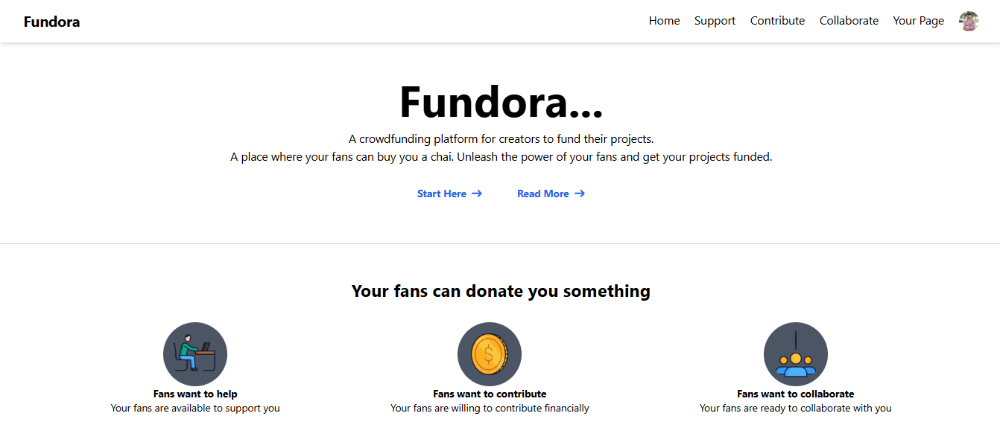

```
# Fundora 🚀  

A **modern crowdfunding platform** that empowers creators to showcase their work and receive support seamlessly. Built with cutting-edge technologies for exceptional performance and a great user experience.

---

## 🚀 Features

- **User Authentication**: Secure sign-up and login using NextAuth.js.
- **Creator Profiles**: Personalized pages for creators to receive support.
- **Payment Integration**: Razorpay integration for seamless payments.
- **Interactive Dashboard**: Track supporters, view earnings, and manage content.
- **Responsive Design**: Fully optimized for mobile and desktop devices.
- **Modern UI**: Styled using Tailwind CSS for clean and beautiful visuals.

---

## 🛠️ Technologies Used

- **Frontend**: Next.js, React.js, Tailwind CSS  
- **Backend**: Next.js API Routes  
- **Authentication**: NextAuth.js  
- **Database**: MongoDB  
- **Payment Integration**: Razorpay API  
- **Deployment**: Vercel  

---

## 📸 Screenshots  

### Landing Page  
  

### Creator Dashboard  
  

---

## ⚙️ Installation & Setup  

Follow these steps to run the project locally:

1. **Clone the repository**:  
   ```bash
   git clone https://github.com/YOUR-USERNAME/fundora.git
   cd fundora
   ```

2. **Install dependencies**:  
   ```bash
   npm install
   ```

3. **Set up environment variables**:  
   Create a `.env` file in the root directory and add:  
   ```plaintext
   DATABASE_URL=your_mongodb_connection_string
   NEXTAUTH_SECRET=your_nextauth_secret
   RAZORPAY_KEY=your_razorpay_api_key
   ```

4. **Run the project**:  
   ```bash
   npm run dev
   ```

5. Open `http://localhost:3000` in your browser.

---

## 🌐 Live Demo  

[**Live Demo**](https://your-live-demo-url.com)  

---

## 🏗️ Project Structure  

```plaintext
.
|-- app/                       # Next.js Pages and API routes
|-- components/                # Reusable components
|-- models/                    # MongoDB models
|-- db/                        # Database connection
|-- public/                    # Static files
|-- styles/                    # Global styles
|-- tailwind.config.js         # Tailwind configuration
|-- next.config.mjs            # Next.js configuration
|-- package.json               # Dependencies
|-- README.md                  # Project documentation
```

---

## 🙌 Acknowledgements  

- **Next.js** - The React framework for production.  
- **NextAuth.js** - Easy authentication for modern web apps.  
- **Razorpay** - Seamless payment gateway.  
- **MongoDB** - Scalable NoSQL database.  

---

## 📞 Contact  

- **Email**: your.email@example.com  
- **LinkedIn**: [Your LinkedIn Profile](https://linkedin.com/in/yourprofile)  

---

⭐ **If you like this project, give it a star!** ⭐  
```

### **Next Steps:**
1. Replace **`YOUR-USERNAME`** with your actual GitHub username.
2. Fill in the placeholders for environment variables, Live Demo URL, and your contact information.
3. Save the file as `README.md` in the root of your project folder.

This will set up a clean, professional README for your **Fundora** project! Let me know if you need further assistance. 😊
